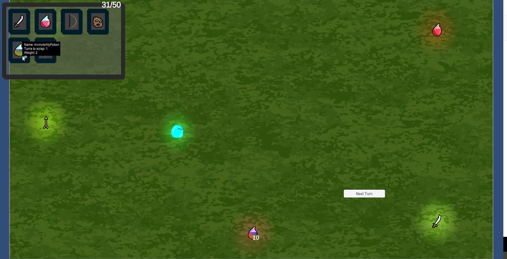

<h1>Inventory Practice</h1>

A mini-game created to better understand Unity's object-oriented programming while implementing a character inventory system 
This project was created for learning purposes.

If you wanna test it you can play it.
<h2>Controls</h2>
Move: w-a-s-d. 
Use items: Left click mouse on it 

<h2>Image</h2>

